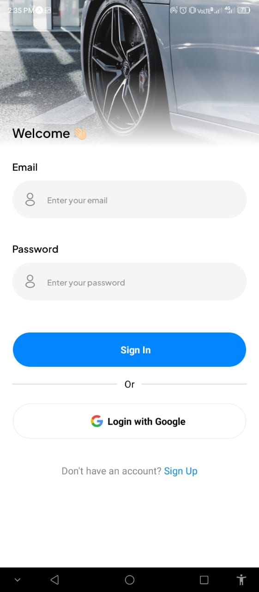
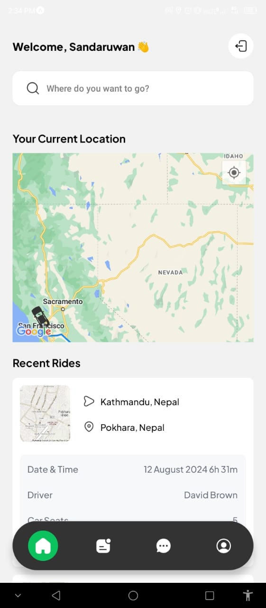
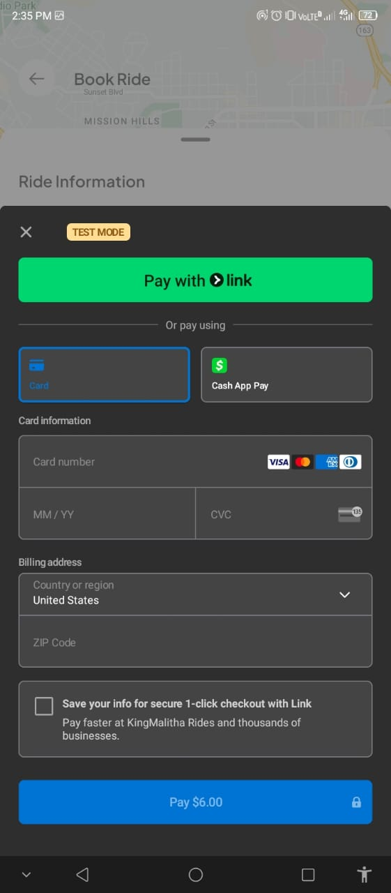

# UBER CLONE APP

This is a clone of the Uber app built using React Native and Expo.

## Installation

1. Clone the repository

   ```bash
   git clone https://github.com/kingmalitha/uber-clone-app.git
   ```

2. Install dependencies

   ```bash
   cd uber-clone-app
   pnpm install
   ```

3. Start the app

   ```bash
    pnpm start
   ```

## Features

- [x] User Authentication (Google OAuth / Email & Password)
- [x] Map View
- [x] Ride Booking
- [x] Ride History
- [x] User Profile
- [x] Driver Profile
- [x] Real-time Location Tracking
- [x] Stripe Payment Integration
- [x] Search for Places with Autocomplete (Google Places API)
- [x] Ride Direction with Google Directions API

## Screens

<p align="center">
  
  
  
</p>

## License

This project is open source and available under the [MIT License](./MIT-LICENSE.txt).
